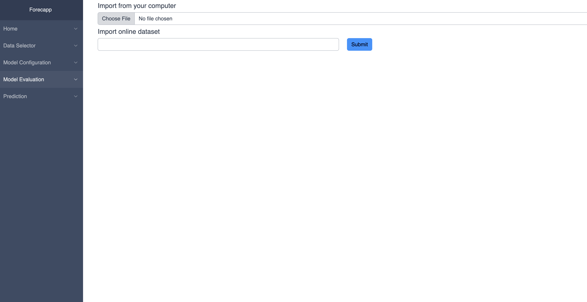
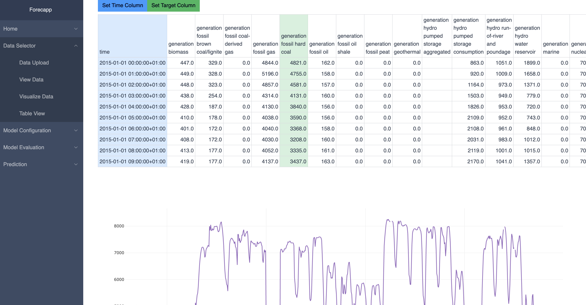
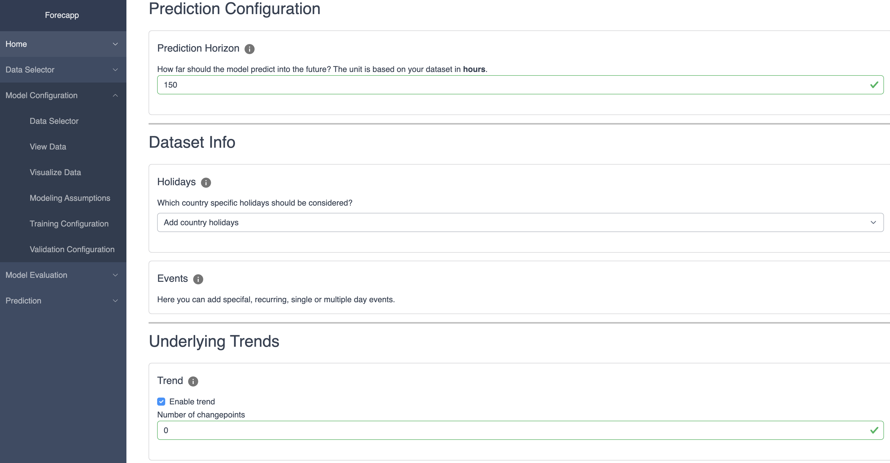
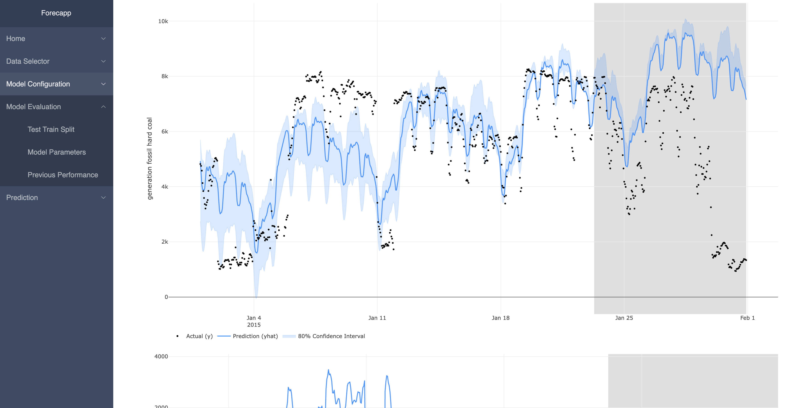
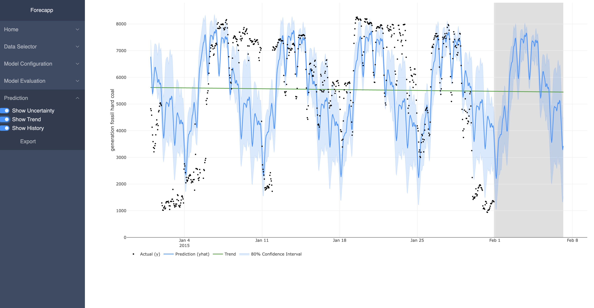

# Forecapp Overview

Forecapp is a web app that gives easy, no-code access to explainable, robust, time series forecasting tools. In the backend, forecapp is based on the [NeuralProphet](https://neuralprophet.com/) framework for explainable time-series forecasting. It is a python package that can be used to build explainable time-series forecasting models. Forecapp takes the functionality of `NeuralProphet` and makes it accessible to people who do not know how to code.

## Pages

### Home Screen

Of course, to get started with a prediction, you first need to upload some data. This can either be done by directly uploading a .csv file containing the time-series data, or by specifying a download link for the data, or by choosing one of the different sample datasets that can be used for playing around with the framework and familiarizing yourself. It is also possible to continue where you previously left off, whith a dataset and model.

### Data Selector

The data selector screen allows the user to choose the dataset columns that should be used for time and prediction. To give more clarity in the process, the page gives an overview of the parsed dataset as well as a plot with the selected time and prediction value. Besides the main screen, there are multiple sub-pages that allow the user to get more insights into the dataset and if there were any problems with parsing it.

### Model Configuration

The time-series model implemented in `NeuralProphet` has a lot of different parameters that have to be tuned to get accurate results. The model configuration screen allows the user to configure these key parameters. The configuration is broken down into different sub-categories which group model parameters to make the amount of selections more digestible.

### Model Evaluation

The model evaluation screen gives you tools to validate their prediction model. This is done using a simple train/test split, where you can specify a portion of data that should be kept for checking the output of the model after it was trained. The validation view shows both the model output as well as the underlying data, and therefore allows to estimate how good of a fit the model is. In addition to this plot, the user can also check the error of the model at every timestep to get a feeling for how good the fit is. Additionally, there are also plots showing the fit of different model parameters, like trend or seasonality that should give further insights into the dataset and the quality of the prediction. To compare the current iteration of the model with other iterations with different parameters, the history view allows viewing previously trained models and their key performance metrics. It also allows rolling back to previous models.

### Prediction

The prediction screen outputs the future prediction of the last selected model configuration. In addition to showing the prediction, it also allows to extract the prediction as well as the model, and visualize different components of the prediction.
